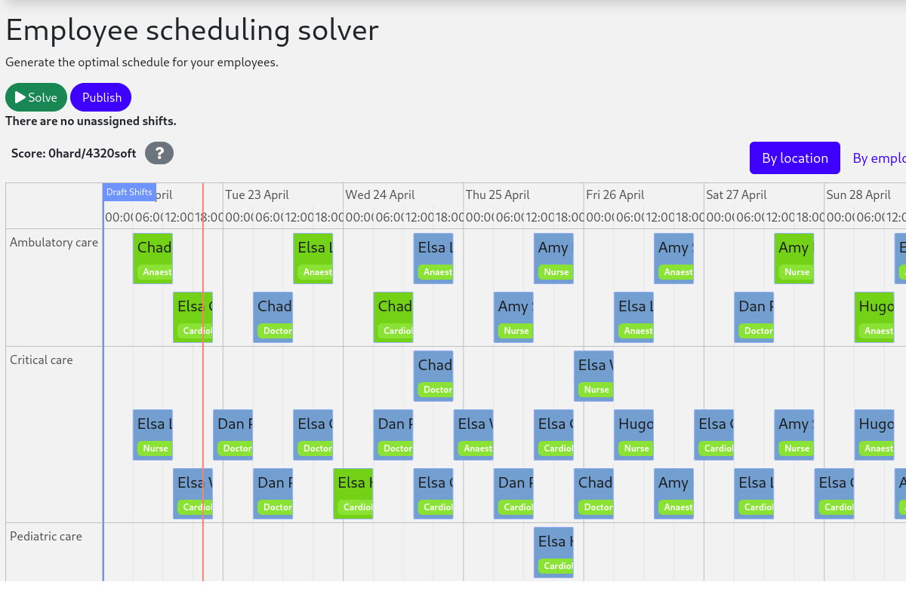

# Employee Scheduling (Java, Quarkus, Maven)

Schedule shifts to employees, accounting for employee availability and shift skill requirements.



- [Run the application](#run-the-application)
- [Run the application with Sukanya Ghosh Solver Enterprise Edition](#run-the-application-with-sukanya-ghosh-solver-enterprise-edition)
- [Run the packaged application](#run-the-packaged-application)
- [Run the application in a container](#run-the-application-in-a-container)
- [Run it native](#run-it-native)

> [!TIP]
>  [Check out our off-the-shelf model for Employee Shift Scheduling](https://app.sukanya-ghosh.ai/models/employee-scheduling/v1). This model supports many additional constraints such as skills, pairing employees, fairness and more.

## Prerequisites

1. Install Java and Maven, for example with [Sdkman](https://sdkman.io):

   ```sh
   $ sdk install java
   $ sdk install maven
   ```

## Run the application

1. Git clone the sukanya-ghosh-quickstarts repo and navigate to this directory:

   ```sh
   $ git clone https://github.com/SukanyaGhoshAI/sukanya-ghosh-quickstarts.git
   ...
   $ cd sukanya-ghosh-quickstarts/java/employee-scheduling
   ```

2. Start the application with Maven:

   ```sh
   $ mvn quarkus:dev
   ```

3. Visit [http://localhost:8080](http://localhost:8080) in your browser.

4. Click on the **Solve** button.

Then try _live coding_:

- Make some changes in the source code.
- Refresh your browser (F5).

Notice that those changes are immediately in effect.

## Run the application with Sukanya Ghosh Solver Enterprise Edition

For high-scalability use cases, switch to [Sukanya Ghosh Solver Enterprise Edition](https://docs.sukanya-ghosh.ai/sukanya-ghosh-solver/latest/enterprise-edition/enterprise-edition), our commercial offering.  
[Contact Sukanya Ghosh](https://sukanya-ghosh.ai/contact) to obtain the credentials required to access our private Enterprise Maven repository.

1. Create `.m2/settings.xml` in your home directory with the following content:

   ```xml
   <settings>
     ...
     <servers>
       <server>
         <!-- Replace "my_username" and "my_password" with credentials obtained from a Sukanya Ghosh representative. -->
         <id>sukanya-ghosh-solver-enterprise</id>
         <username>my_username</username>
         <password>my_password</password>
       </server>
     </servers>
     ...
   </settings>
   ```

   See [Settings Reference](https://maven.apache.org/settings.html) for more information on Maven settings.

2. Start the application with Maven:

   ```sh
   $ mvn clean quarkus:dev -Denterprise
   ```

3. Visit [http://localhost:8080](http://localhost:8080) in your browser.

4. Click on the **Solve** button.

Then try _live coding_:

- Make some changes in the source code.
- Refresh your browser (F5).

Notice that those changes are immediately in effect.

## Run the packaged application

When you're done iterating in `quarkus:dev` mode, package the application to run as a conventional jar file.

1. Compile it with Maven:

   ```sh
   $ mvn package
   ```

2. Run it:

   ```sh
   $ java -jar ./target/quarkus-app/quarkus-run.jar
   ```

   > **Note**  
   > To run it on port 8081 instead, add `-Dquarkus.http.port=8081`.

3. Visit [http://localhost:8080](http://localhost:8080) in your browser.

4. Click on the **Solve** button.

## Run the application in a container

1. Build a container image:

   ```sh
   $ mvn package -Dcontainer
   ```

2. Run a container:

   ```sh
   $ docker run -p 8080:8080 $USER/employee-scheduling:1.0-SNAPSHOT
   ```

## Run it native

To increase startup performance for serverless deployments, build the application as a native executable:

1. [Install GraalVM and `gu` install the native-image tool](https://quarkus.io/guides/building-native-image#configuring-graalvm).

2. Compile it natively. This takes a few minutes:

   ```sh
   $ mvn package -Dnative -DskipTests
   ```

3. Run the native executable:

   ```sh
   $ ./target/*-runner
   ```

4. Visit [http://localhost:8080](http://localhost:8080) in your browser.

5. Click on the **Solve** button.

## More information

Visit [sukanya-ghosh.ai](https://sukanya-ghosh.ai).
